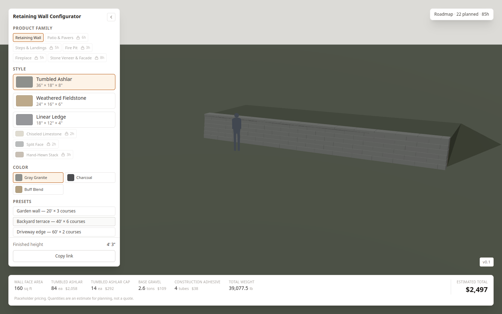

# Hardscape Wall Configurator

A 3D configurator for segmental retaining walls. You pick a style and a color,
you set the length and the number of courses, and you get the wall in 3D and a
list of the materials it needs. You can then send that estimate to yourself.

**Live demo:** https://hardscape-configurator.hardscape-configurator.workers.dev



## Three decisions behind it

**The scene is a function of the state.** There is one configuration object. A
pure function turns it into the position, rotation and size of every block. The
3D scene only draws what that function returns. It does no geometry of its own.

**The catalog is data, not code.** The SKUs, their sizes and their colorways
live in one file. If you replace that file, you get a different product. You do
not touch the rendering code.

**The scene and the estimate read the same model.** The takeoff counts the same
array of blocks that the scene draws. If the screen shows 84 blocks, the
estimate says 84 units. There is no second count anywhere, so the two cannot
disagree.

## Why instanced rendering

A 40 foot wall with 6 courses is 84 blocks. An 80 foot wall with 10 courses is
275. Every block is the same box with a different position and size. Drawing
them one by one would mean hundreds of separate draw calls. Instead they are
drawn as instances: one geometry, one material, one draw call for the whole
wall. The GPU repeats the same geometry, instead of the CPU sending one draw
call per block.

## What is real and what is placeholder

**Placeholder.** The SKUs, their dimensions, their colorways and all the prices
are made up. They wait for a real product sheet. The style names are
descriptive on purpose, like `Tumbled Ashlar` or `Split Face`, so that nobody
mistakes them for a real manufacturer's product line.

**Real.** The geometry is real: the running bond, the setback on each course,
the clipped block at the end of a run, the cap course. The quantities are real
and every number comes from a formula. The weight is calculated from the volume
of concrete at 145 lb per cubic foot, not stored as a constant. The lead capture
is real and writes to a live database.

## Run it locally

```bash
npm install
cp .env.example .env    # add your Supabase URL and anon key
npm run dev
```

The app runs without those keys. Only the lead form needs them, and it says so
if they are missing.

## Time invested

About six hours across two evenings.

## A note on npm audit

`npm audit` reports three advisories. All of them come from the deploy tool,
through `wrangler` to `miniflare` to `sharp`. These are development
dependencies. They are not part of the code that ships to the browser. The fix
that npm suggests breaks `wrangler`, so it has not been applied.

## An honest note

I have no professional experience with Three.js. My background is architecture
and technical drawings.

That background helped more than I expected. I know how a retaining wall is
built, so I knew the wall had to be modelled in courses and not in a single
block, and I knew each course steps back from the one below it. I also know
what a drawing needs to be readable, and that turned out to be most of the work
on the 3D view.

What I did not know was the library. So I kept the 3D part small and pushed
every decision out of it. All the geometry is plain TypeScript that runs
without a canvas. I could check the numbers by hand before anything was drawn.
The scene only reads them. When the picture looked wrong, I could be sure the
problem was the camera or the light, and not the wall.
